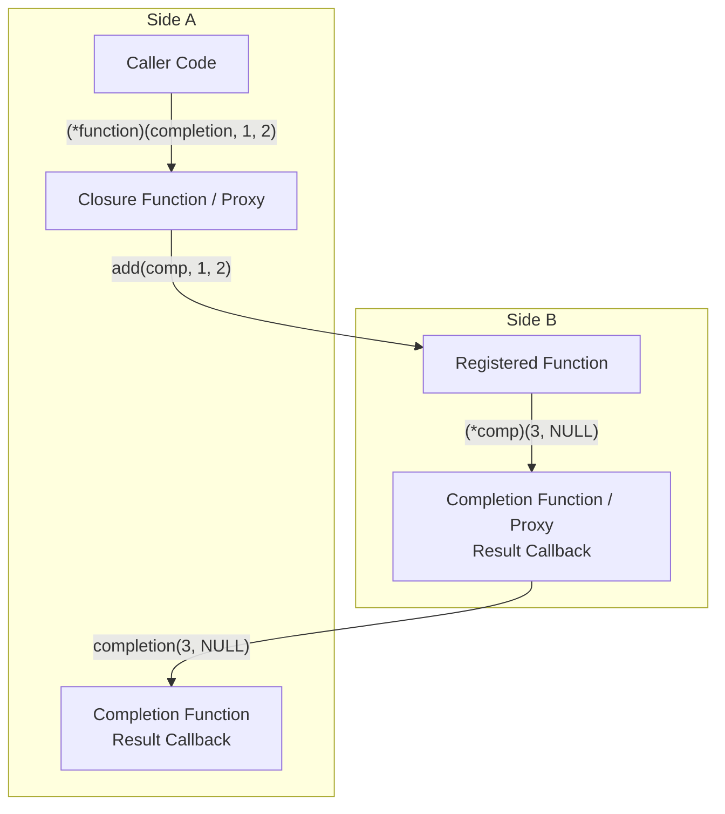

# tra-ffic

Universal asynchronous full-duplex marshaling helper library.


[](https://www.repostatus.org/#wip)
[](https://opensource.org/licenses/MIT)

---

[(For Japanese language/日本語はこちら)](./README_ja.md)

> Please note that this English version of the document was machine-translated and then partially edited, so it may contain inaccuracies.
> We welcome pull requests to correct any errors in the text.

## What Is This?

tra-ffic is a universal native marshaling helper that uses libffi. It is a header-only library.

It connects two logically defined control units (called 'side A/B') and enables native function calls.
libffi is responsible for native-call stack building and closure function management.

At first glance, the called function entry point looks like a normal function call that receives value types and function pointers.
The distinguishing feature is that tra-ffic makes this call easy to perform and automatically manages function closures.

It is mainly intended to be used as a marshaler that connects two different runtime systems.

The following is a minimal call example that only handles simple types:

```c
#include "tra_ffic.h"

#include <stdio.h>

// Adds the argument values.
static void add(
    tra_ffic_completion completion,
    int32_t a, int32_t b) {
  int32_t result = a + b;
  // Return values are delivered through completion.
  completion(&result, NULL);
}

// Function pointer type for add.
typedef void (*add_func)(
    tra_ffic_completion completion,
    int32_t a, int32_t b);

// Receives the result.
static void on_result(
    void *user_data,
    const int32_t result,
    const tra_ffic_error *error) {
  printf("%d\n", result);
}

int main(void) {
  // Initialize tra-ffic.
  tra_ffic_task_queue queue;
  tra_ffic_task_queue_init(&queue, NULL, NULL);

  // Define the source (side A) and destination (side B).
  tra_ffic_side side_a, side_b;
  tra_ffic_error error;
  tra_ffic_side_init_pair(
    &side_a, &side_b,
    tra_ffic_task_queue_schedule_callback,
    &queue, &error);

  // ------------------------------------------------
  // Example: call side B's add function from side A.

  // Define the add function signature: `int32 (int32,int32)`.
  tra_ffic_type arg_types[] = { tra_ffic_type_int32(), tra_ffic_type_int32() };
  tra_ffic_type return_type = tra_ffic_type_int32();
  tra_ffic_signature signature = tra_ffic_signature_stack(
    TRA_FFIC_SIGNATURE_ABI_COMPLETION, 2u, arg_types, &return_type);

  // Create the add function on side B.
  add_func function;
  tra_ffic_side_create_pure_function(
    &side_b,
    &signature, add,
    &function, &error);

  // Create the completion function on side A.
  tra_ffic_completion comp;
  tra_ffic_side_create_completion_function(
    &side_a,
    &return_type, on_result,
    &comp, NULL, &error);

  // Prepare argument values and storage for the received return value,
  // then call the function from side A.
  // result = add(40, 2)
  (*function)(comp, 40, 2);

  // Wait until the function call completes.
  tra_ffic_task_drain_finalization(&queue);

  // (Cleanup...)
}
```

In this case, calling the `add` function may look more complicated than necessary.

It may seem enough to simply call `add` directly. However, going through tra-ffic has the benefit of automatically performing function pointer marshaling, closure creation, and lifetime management.
For example, if it is used as a cross-call infrastructure in mechanically generated code, it can provide fully asynchronous full-duplex native marshaling.

### Environment

- POSIX
- Win32
- libffi

---

## Installation

tra-ffic requires libffi. On Debian/Ubuntu environments, it can be installed from packages:

```bash
sudo apt update
sudo apt install -y libffi-dev
```

On Win32 environments, you need to obtain and build the code from the [libffi repository](https://github.com/libffi/libffi/).
The [Makefile](./Makefile) may be useful as a reference for the build process.

Once libffi is ready, copy [`include/tra_ffic.h`](./include/tra_ffic.h) into your project and include it:

```c
#include "tra_ffic.h"
```

Because this is a header-only library, that is all you need.

---

## Structure

tra-ffic is used by defining "sides" that represent logical callers/callees and by placing functions that belong to those sides.
A side does not permanently determine a caller or callee role. It is full-duplex and bidirectional.

The core functionality automates function calls, return-value handling, and especially function pointer marshaling operations.
Users can handle so-called closure functions as function pointers without worrying about what is happening underneath.

tra-ffic also manages the lifetime of closure functions and lets external code control lifetime extension and destruction.
This makes it easier to connect systems with different runtimes and manage closure functions according to each runtime's lifetime.



## Usage

### Initialization

To use tra-ffic, first initialize a task queue for deferred execution, then initialize two sides as a pair with that queue as the scheduler.

Sides represent logical callers/callees.
For example, when calling a function registered on side B from side A, side A is the caller and side B is the callee.

The scheduler passed to `tra_ffic_side_init_pair()` must not execute tasks immediately while a libffi trampoline is running. It must enqueue them so they can be executed later.
For simple use cases, you can use the built-in `tra_ffic_task_queue` and `tra_ffic_task_queue_schedule_callback`.
Call `tra_ffic_task_drain_finalization()` when you want to advance function calls and completion-function delivery.
The second argument to `tra_ffic_task_queue_init()` is an optional notification callback that is invoked after work is queued, and the third argument is user state passed to that callback; pass `NULL, NULL` when you do not need notification.

```c
#include "tra_ffic.h"

#include <stdio.h>

int main(void) {
  tra_ffic_task_queue queue;
  tra_ffic_side side_a;
  tra_ffic_side side_b;
  tra_ffic_error error;

  // Initialize the queue.
  if (!tra_ffic_task_queue_init(&queue, NULL, NULL)) {
    fprintf(stderr, "failed to initialize task queue\n");
    return 1;
  }

  // Initialize the side pair and connect it to the queue.
  if (!tra_ffic_side_init_pair(
      &side_a,
      &side_b,
      tra_ffic_task_queue_schedule_callback,
      &queue,
      &error)) {
    fprintf(stderr, "%s\n", error.message);
    tra_ffic_task_queue_destroy(&queue);
    return 1;
  }

  // (Create function pointers, call functions, create completion functions, and so on here...)

  // Execute queued completion deliveries and release operations.
  tra_ffic_task_drain_finalization(&queue);

  // After releasing created function pointers, destroy the sides and queue.
  tra_ffic_side_destroy(&side_a);
  tra_ffic_side_destroy(&side_b);
  // Execute destruction tasks scheduled by the sides.
  tra_ffic_task_drain_finalization(&queue);
  tra_ffic_task_queue_destroy(&queue);
  return 0;
}
```

After initialization, register a function on one side, create a completion function on the other side, and call it.
Release caller-owned function pointers returned by create APIs with `tra_ffic_function_release()` after use. This is described later.
Before calling `tra_ffic_side_destroy()`, prevent new calls that can reach the side, including calls through adapters, and wait for all calls and completion deliveries involving it to finish. Destroying a side that is still in use is unsupported.

When a notification callback is passed as the second argument to `tra_ffic_task_queue_init()`, it is invoked with the third-argument user state when pending completion requests exist.
tra-ffic does not use internal worker threads, so note that this callback runs in the thread context where the completion request was created.

If you want to process completion requests cooperatively, you can call `tra_ffic_task_drain_finalization()` from this callback.
For example, when control of the main thread is held by a message pump such as GLib, you can use this callback to process completion requests.

### Basic Types

Except for special cases, all function calls are made through function pointers generated by tra-ffic.
To generate one of these function pointers, you need to provide the function signature: the type definitions of its arguments and return value.
In other languages, this information corresponds to type metadata.

This is required because tra-ffic internally performs automated marshaling: it reinterprets and controls arguments and return values.
Therefore, the first step is to build a function signature.

To build a function signature, you need to identify the argument and return-value types.
The types available in tra-ffic, excluding function pointers, are `void`, `bool`, `int8`, `uint8`, `int16`, `uint16`, `int32`, `uint32`, `int64`, `uint64`, `float`, `double`, `pointer` (`void *`), `buffer_view` (`tra_ffic_buffer_view`), `string` (string: `const char *`), and `struct` (a native C structure passed by value).

- Use `tra_ffic_type_*` to describe these types.
- `void` is only for return values and cannot be used as an argument.
- `float` and `double` handle C floating-point values as-is, including `NaN` and `Inf`.
- `pointer` is treated as a borrowed `void *`, and `NULL` can be passed.
- `buffer_view` is treated as a borrowed mutable byte span, `struct { void *data; uintptr_t size; }`. `data` may be `NULL` only when `size` is zero.
- `string` is treated as a borrowed `const char *`, and `NULL` can be passed.
- `struct` is described by `tra_ffic_type_struct()` with one type descriptor for each field in native declaration order.
- Function pointer values can also be passed and returned as `NULL`; a `NULL` function pointer is propagated as a value and is not registered as a closure.
- Strings returned as completion values are copied by tra-ffic before being passed to the result callback.
- Buffer views returned as completion values do not copy the pointed-to buffer; only the view structure is copied.
- Completion-function callbacks also receive a C value corresponding to the signature's return type and a `const tra_ffic_error *`.
- `TRA_FFIC_SIGNATURE_ABI_COMPLETION` exposes functions as `void(tra_ffic_completion, ...typed_args)`.
- `TRA_FFIC_SIGNATURE_ABI_RETVAL` exposes functions as `return_type(...typed_args)`. It is synchronous only; returned `string`, `buffer_view`, and `function` values are borrowed in v1.
- `tra_ffic_signature_stack()` exposes logical arguments as individual typed parameters.
- `tra_ffic_signature_pointer_list()` exposes logical arguments as `void *const *args`; `args[i]` points to the storage for the i-th logical argument.
- `tra_ffic_side_create_pure_pointer_list_function()` and `tra_ffic_side_create_pointer_list_closure()` let the implementation callback receive that same pointer list even when the public signature is stack-based.

The following example defines a function signature. Assume that an imaginary `foobar` function exists and that this is its signature:

```c
// Function signature definition:
// `const char *foobar(bool, int32_t, uint32_t, double, const char *)`
tra_ffic_type arg_types[] = {
    tra_ffic_type_bool(),
    tra_ffic_type_int32(),
    tra_ffic_type_uint32(),
    tra_ffic_type_double(),
    tra_ffic_type_string(),
};
tra_ffic_type return_type = tra_ffic_type_string();
tra_ffic_signature signature = tra_ffic_signature_stack(
    TRA_FFIC_SIGNATURE_ABI_COMPLETION, 5u, arg_types, &return_type);
```

- Note that the function signature does not include the function name (`foobar` here).

### Structure Types

`tra_ffic_type_struct()` describes a native C structure as an ordered list of field types. Field names are not part of the metadata; the field count, order, types, and nesting must exactly match the C declaration.

When a function is registered, tra-ffic recursively clones this logical metadata and compiles a private libffi ABI graph. Each structure becomes an `ffi_type` structure whose elements describe its fields, and `ffi_get_struct_offsets()` calculates their offsets. A function field is represented to libffi as a native pointer while its nested tra-ffic signature is retained for function-adapter generation. Applications do not construct or manage `ffi_type` objects themselves.

For example, the following native structure contains a function in a nested structure:

```c
typedef struct request_type_equivalent {
  int32_t request_id;
  struct {
    item_callback on_item;
  } callbacks;
  const char *label;
} request_type_equivalent;
```

The following example expresses it as logical metadata:

```c
typedef void (*item_callback)(
    tra_ffic_completion completion,
    int32_t item_id);

typedef struct hooks {
  item_callback on_item;
} hooks;

typedef struct request {
  int32_t request_id;
  hooks callbacks;
  const char *label;
} request;

tra_ffic_type callback_arg_types[] = {
    tra_ffic_type_int32(),
};
tra_ffic_type callback_return_type = tra_ffic_type_void();
tra_ffic_signature callback_signature = tra_ffic_signature_stack(
    TRA_FFIC_SIGNATURE_ABI_COMPLETION,
    1u,
    callback_arg_types,
    &callback_return_type);

tra_ffic_type hooks_field_types[] = {
    tra_ffic_type_function(&callback_signature),
};
tra_ffic_type hooks_type =
    tra_ffic_type_struct(1u, hooks_field_types);

tra_ffic_type request_field_types[] = {
    tra_ffic_type_int32(),
    hooks_type,
    tra_ffic_type_string(),
};
tra_ffic_type request_type =
    tra_ffic_type_struct(3u, request_field_types);

tra_ffic_type receive_arg_types[] = {
    request_type,
};
tra_ffic_type receive_return_type = tra_ffic_type_void();
tra_ffic_signature receive_signature = tra_ffic_signature_stack(
    TRA_FFIC_SIGNATURE_ABI_COMPLETION,
    1u,
    receive_arg_types,
    &receive_return_type);
```

The descriptor-building helpers borrow their metadata arguments. Function-registration APIs recursively clone the full graph, so local metadata arrays may be discarded after registration succeeds. A manually constructed `tra_ffic_function_ref`, or one filled by `tra_ffic_function_ref_from_raw()`, must keep its referenced signature metadata alive while the reference is used.

Structured call helpers use `tra_ffic_value_struct(&value)`. The pointer is borrowed and must be non-`NULL` and point to a value with the exact native layout described by the matching metadata.

Structure fields are marshaled recursively:

| Field kind | Arguments | Completion result | RETVAL result |
|---|---|---|---|
| Scalars and nested structures | Copied by value | Copied by value | Returned by value |
| `string` | String pointer is borrowed | String contents are copied recursively | Borrowed |
| `pointer` | Borrowed | Borrowed | Borrowed |
| `buffer_view` | View is copied; buffer is borrowed | View is copied; buffer is borrowed | View is copied; buffer is borrowed |
| `function` | Valid for the callback; retain it if stored | Valid for the result callback; retain it if stored | Borrowed in v1 |

Function fields may be `NULL`. Non-`NULL` fields must refer to functions registered with tra-ffic. If the registered function has the same logical signature but uses the other argument-passing form (`stack` or `pointer-list`), tra-ffic creates an adapter automatically. This applies recursively to functions in nested structures and to structures nested in function signatures. If a function received through an argument or completion callback is stored after that callback returns, call `tra_ffic_function_retain()` and later balance it with `tra_ffic_function_release()`.

For a synchronous RETVAL result, an adapter synthesized by tra-ffic remains owned by its side so the borrowed returned pointer stays callable until that side is destroyed. Receiving a borrowed RETVAL function does not add caller ownership, so do not release it unless you first retain it. If an application needs to extend its lifetime explicitly, call `tra_ffic_function_retain()` and later release exactly that retain. No retain remains valid after the owning side is destroyed.

If any nested field is invalid, all scratch storage and function adapters created for that conversion are rolled back. Completion ABI calls report an error. A RETVAL closure cannot report an error, so it returns the zero value for the declared return type.

Only ordinary, non-empty C structures using the platform's natural ABI layout are supported. The following are not supported:

- packed structures;
- unions and bit-fields;
- C arrays and flexible array members;
- empty structures;
- explicitly over-aligned structures or fields;
- cyclic/by-value-recursive metadata;
- metadata deeper than `TRA_FFIC_MAX_TYPE_DEPTH` (currently 16).

The metadata does not include a user-supplied size, alignment, or offset. Therefore, the compiler's C layout must agree with libffi for every field. Do not use structure metadata to describe a layout produced by serialization, `#pragma pack`, or a foreign ABI.

### Completion Functions (TRA_FFIC_SIGNATURE_ABI_COMPLETION)

The standard function definition in tra-ffic uses `TRA_FFIC_SIGNATURE_ABI_COMPLETION`.
This returns results through a `tra_ffic_completion` function instead of the function's return value.
A registered function receives a `completion` function. If the operation succeeds, pass the address of a value corresponding to the return type. If it fails, pass an error message.

This structure is more complex than ordinary function return values, but it supports asynchronous operations and gives returned strings (`const char *`) a clear lifetime.

```c
// Example division function.
static void divide(
    tra_ffic_completion completion,  // Pointer to the completion function that returns the result.
    double a,
    double b) {
  if (b == 0.0) {
    // You can return an error.
    completion(NULL, "division by zero");
    return;
  }

  // Return the result value.
  // It must have the type indicated by the signature's return_type.
  double result = a / b;
  completion(&result, NULL);
}

// Example function that returns a string.
static void return_name(tra_ffic_completion completion) {
  // Return the result value.
  const char *result = "tra-ffic";
  completion(&result, NULL);
}

// Example void function.
static void do_nothing(tra_ffic_completion completion) {
  // Use NULL when return_type is void.
  completion(NULL, NULL);
}
```

`completion` can also be called from a different thread.
For example, processing can finish on another thread or event loop before calling `completion(&value, NULL)`.
This makes it possible to implement asynchronous functions.
However, only the first call is adopted as the result. The second and later calls are ignored.

The completion-function callback receives `error == NULL` on success and a `const tra_ffic_error *` on failure.
On failure, the return-value argument is the zero value corresponding to the type, or `NULL`.

### Retval Functions (TRA_FFIC_SIGNATURE_ABI_RETVAL)

For simple existing C APIs, you can use `TRA_FFIC_SIGNATURE_ABI_RETVAL`.
However, the native function returns its result directly and cannot complete asynchronously or report errors through `tra_ffic_completion`.

```c
typedef int32_t (*add_func)(int32_t a, int32_t b);

static int32_t add(int32_t a, int32_t b) {
  return a + b;
}

tra_ffic_type arg_types[] = { tra_ffic_type_int32(), tra_ffic_type_int32() };
tra_ffic_type return_type = tra_ffic_type_int32();
tra_ffic_signature signature = tra_ffic_signature_stack(
    TRA_FFIC_SIGNATURE_ABI_RETVAL, 2u, arg_types, &return_type);
```

### Function Pointers (Closures)

When writing code only in C, function pointers are usually statically determined, so you do not need to worry about this.
However, in complex code, functions are often called with additional state information that identifies the call:

```c
// state is auxiliary information.
void foobar_impl(int a, double b, void *state) {
  foobar_state *s = state;

  // Use state to perform function processing...
}
```

In this case, the function caller needs to manage the function pointer and state as a pair:

```c
// Function pointer for foobar_impl.
typedef void (*foobar_func)(int a, double b, void *state);

{
  // Obtain the function pointer for foobar_impl.
  foobar_func *foobar = &foobar_impl;
  // Prepare foobar's state.
  foobar_state *state = ...;

  // The state argument is always required to call foobar_impl.
  (*foobar_func)(1, 5.0, state);
}
```

However, in many cases, a function only accepts a function pointer and cannot accept state:

```c
// A general function definition does not receive state information.
typedef void (*foobar_func)(int a, double b);

void print_result(foobar_func f) {
  (*f)(1, 5.0, state);   // State cannot be passed.
}
```

In this situation, use a "closure function" that wraps state information inside the function pointer.
Conceptually, this is similar to creating a function object in JavaScript/TypeScript:

```typescript
// Example TypeScript closure.
const state = { ... };

// A function object in the form `(int a, double b): void`,
// but it contains state (a closure).
const f = (a: number, b: number) => {
  // State can be referenced, so it can be used for processing.
};

// The signature of function f does not include state.
const print_result = (f: (a: number, b: number) => void) => {
  f(1, 5.0);  // State is passed implicitly.
};
```

tra-ffic implements this at the C language level.
`tra_ffic_side_create_closure()` takes a pure function pointer and paired state, encapsulates them, and generates a new function pointer that looks like a pure function pointer:

```c
// Structure that defines state.
typedef struct add_state {
  int32_t offset;
} add_state;

// Adds the offset obtained from state.
static void add_offset(
    tra_ffic_completion completion,
    void *closure_state,  // State is passed here.
    int32_t value) {
  // The values in state are accessible.
  add_state *state = (add_state *)closure_state;
  int32_t result = value + state->offset;
  completion(&result, NULL);
}

// Receives the result (continuation function).
static void on_result(
    void *user_data,
    const int32_t result,
    const tra_ffic_error *error) {
  if (error != NULL) {
    return;
  }
  *(int32_t *)user_data = result;
}

typedef void (*add_offset_func)(
    tra_ffic_completion completion, int32_t value);

int main(void) {
  // (Initialization...)

  // Define the add_offset function signature: `int32 (int32)`.
  tra_ffic_type arg_types[] = { tra_ffic_type_int32() };
  tra_ffic_type return_type = tra_ffic_type_int32();
  tra_ffic_signature signature = tra_ffic_signature_stack(
    TRA_FFIC_SIGNATURE_ABI_COMPLETION, 1u, arg_types, &return_type);

  // Create an add_offset closure function with state on side B.
  add_state state = {3};
  add_offset_func function;
  tra_ffic_side_create_closure(
    &side_b,
    &signature, add_offset,
    &state,  // State to encapsulate.
    NULL,
    &function, &error);

  // Create the completion function on side A.
  tra_ffic_completion comp;
  int32_t result = 0;
  tra_ffic_side_create_completion_function(
    &side_a,
    &return_type, on_result,
    &comp, &result, &error);

  // Prepare argument values and storage for the received return value,
  // then call the function from side A.
  // result = add_offset(39)
  (*function)(comp, 39);

  // Wait until the function call completes.
  tra_ffic_task_drain_finalization(&queue);

  printf("%d\n", result);

  // Release the functions.
  tra_ffic_function_release(comp, &error);
  tra_ffic_function_release(function, &error);

  // (Cleanup...)
}
```

> Note: This example assumes a `TRA_FFIC_SIGNATURE_ABI_COMPLETION` signature,
> but it can also be implemented with `TRA_FFIC_SIGNATURE_ABI_RETVAL`.

Closure functions store their information in dynamically allocated memory.
tra-ffic automatically releases the temporary active protection used while a call or completion delivery is running. This does not release the caller-owned retain returned by a create API.

The closure function returned by `tra_ffic_side_create_closure()` has an internal reference count of 1, so it must be released with `tra_ffic_function_release()` after use.

Creating a pure function or closure again with the same side, signature, callback, state, and finalizer may return the same function pointer.
Each successful create still adds one internal retain, so call `tra_ffic_function_release()` once for each successful create.
Calling `tra_ffic_function_retain()` or `tra_ffic_function_release()` with a `NULL` function pointer is accepted as a no-op.

You may also store a passed closure function somewhere and use it later.
In that case, use `tra_ffic_function_retain()` to extend the lifetime of the function pointer:

```c
// Function pointer stored for later calls.
typedef void (*callback_func)(tra_ffic_completion completion, int32_t value);
static callback_func callback = NULL;

// Function that calls the callback later.
static void register_callback(
    tra_ffic_completion completion,
    callback_func cb) {
  tra_ffic_error error;

  // Extend the callback function's lifetime.
  // Without extending the lifetime, it may be released unintentionally.
  if (!tra_ffic_function_retain(cb, &error)) {
    completion(NULL, error.message);
    return;
  }

  // Store the callback function pointer.
  callback = cb;

  // This function is now complete.
  completion(NULL, NULL);
}

// Function that is called back.
static void cbfunc(
  tra_ffic_completion completion,
  int32_t value) {

  completion(NULL, NULL);
}

// Function called from another place as a result of side B's internal processing.
void on_callback(int32_t value) {
  // Ignore the call result (fire and forget: tra_ffic_ignored_completion).
  callback(tra_ffic_ignored_completion, value);
}

typedef void (*cbfunc_func)(
  tra_ffic_completion completion, int32_t value);
typedef void (*register_callback_func)(
  tra_ffic_completion completion, callback_func cb);

static void on_registered(
    void *user_data,
    const tra_ffic_error *error) {
  (void)user_data;
  if (error != NULL) {
    fprintf(stderr, "%s\n", error->message);
  }
}

int main(void) {
  // (...)

  // Define the register_callback function signature: `int32 (void (*)(int32))`.
  tra_ffic_type farg_types[] = { tra_ffic_type_int32() };
  tra_ffic_type freturn_type = tra_ffic_type_void();
  tra_ffic_signature fsignature = tra_ffic_signature_stack(
    TRA_FFIC_SIGNATURE_ABI_COMPLETION, 1u, farg_types, &freturn_type);
  tra_ffic_type arg_types[] = { tra_ffic_type_function(&fsignature) };
  tra_ffic_type return_type = tra_ffic_type_void();
  tra_ffic_signature signature = tra_ffic_signature_stack(
    TRA_FFIC_SIGNATURE_ABI_COMPLETION, 1u, arg_types, &return_type);

  // Create the register_callback function on side B.
  register_callback_func function;
  tra_ffic_side_create_pure_function(
    &side_b,
    &signature, register_callback,
    &function, &error);

  // Create the function that will be called back on side A.
  cbfunc_func cbfunction;
  tra_ffic_side_create_pure_function(
    &side_a,
    &fsignature, cbfunc,
    &cbfunction, &error);

  // Create the completion function for register_callback.
  tra_ffic_completion comp;
  tra_ffic_side_create_completion_function(
    &side_a,
    &return_type, on_registered,
    &comp, NULL, &error);

  // Call register_callback with the callback function.
  // register_callback(cbfunc)
  (*function)(comp, cbfunction);

  // Release register_callback.
  tra_ffic_function_release(comp, &error);
  tra_ffic_function_release(function, &error);

  // cbfunc is retained inside register_callback, so it is not released here yet.
  tra_ffic_function_release(cbfunction, &error);

  // (...)
}
```

Note: Although this is not shown in the code, `tra_ffic_function_release()` must be called when the function pointer on side B is no longer needed.

---

## Building and Testing

Run the POSIX and Win32 tests together:

```bash
sudo apt update
sudo apt install -y libffi-dev pkg-config
make test-all
```

Run the normal, Valgrind, and ASAN tests for POSIX:

```sh
make test
```

The development tests build 64-bit Windows binaries under the Win32 target name and run them with Wine.
libffi for the Win32 build is built locally for mingw-w64:

```sh
make test-win32
```

`x86_64-w64-mingw32-gcc` builds the Win32 test binaries, and `wine` runs them.
The Win32 tests do not use Valgrind or ASAN.

## Notes

This project began when I considered porting the core functionality of [DupeNukem](https://github.com/kekyo/DupeNukem/) to native code.

While working on a similar implementation in ["muon" project](https://github.com/kekyo/muon-ui/), I decided to spin it off into a completely independent library, believing it would be worthwhile to establish it as such (in reality, it was quite complex, so this decision was made with independence and testability in mind).

## License

Under MIT
