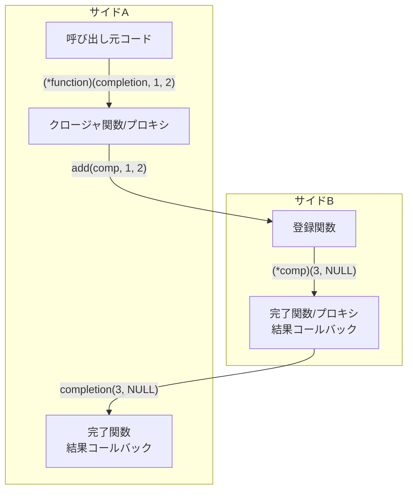

# tra-ffic

libffiを使用する、汎用ネイティブ全二重非同期マーシャリングヘルパーライブラリ


[](https://www.repostatus.org/#wip)
[](https://opensource.org/licenses/MIT)

---

[(English language is here)](./README.md)

## これは何?

libffiを使用する、汎用のネイティブマーシャリングヘルパーで、ヘッダオンリーライブラリです。

論理的に定義される2つの制御単位間（サイドA/B）を接続して、ネイティブ関数呼び出しを実現します。
libffiはネイティブ呼び出しのスタックビルダーとクロージャ関数管理の役割を担っています。

呼び出される関数エントリポイントは、一見すると一般的な値型と関数ポインタが与えられる関数呼び出しに見えますが、
この関数呼び出しを簡単に実現し、関数クロージャの管理を自動的に行うことが出来ることが特徴です。

主に、異なる2つのランタイム処理系を接続するマーシャラーとして使用することを意図しています。

以下は、単純型のみ扱う、最小の呼び出し例です:

```c
#include "tra_ffic.h"

#include <stdio.h>

// 引数の値を加算する関数
static void add(
    tra_ffic_completion completion,
    int32_t a, int32_t b) {
  int32_t result = a + b;
  // 戻り値はcompletionを通じて返す
  completion(&result, NULL);
}

// add関数の関数ポインタ型
typedef void (*add_func)(
    tra_ffic_completion completion,
    int32_t a, int32_t b);

// 結果を受信する関数
static void on_result(
    void *user_data,
    const int32_t result,
    const tra_ffic_error *error) {
  printf("%d\n", result);
}

int main(void) {
  // tra-fficの初期化
  tra_ffic_task_queue queue;
  tra_ffic_task_queue_init(&queue, NULL, NULL);

  // 送信元(サイドA)と送信先(サイドB)の定義
  tra_ffic_side side_a, side_b;
  tra_ffic_error error;
  tra_ffic_side_init_pair(
    &side_a, &side_b,
    tra_ffic_task_queue_schedule_callback,
    &queue, &error);

  // ------------------------------------------------
  // サイドAからサイドBのadd関数を呼び出す例

  // add関数のシグネチャを定義 `int32 (int32,int32)`
  tra_ffic_type arg_types[] = { tra_ffic_type_int32(), tra_ffic_type_int32() };
  tra_ffic_type return_type = tra_ffic_type_int32();
  tra_ffic_signature signature = {
    TRA_FFIC_SIGNATURE_ABI_COMPLETION, 2u, arg_types, &return_type};

  // サイドBにadd関数を生成
  add_func function;
  tra_ffic_side_create_pure_function(
    &side_b,
    &signature, add,
    &function, &error);

  // サイドAに完了関数を生成
  tra_ffic_completion comp;
  tra_ffic_side_create_completion_function(
    &side_a,
    &return_type, on_result,
    &comp, NULL, &error);

  // 関数に与える引数値と受信する戻り値を格納する変数を準備して、サイドAから関数を呼び出す
  // result = add(40, 2)
  (*function)(comp, 40, 2);

  // 関数の呼び出しが完了するのを待つ
  tra_ffic_task_drain_finalization(&queue);

  // (終了処理...)
}
```

この場合、add関数の呼び出しが必要以上に複雑になっているように見えます。

単純にadd関数を直接呼び出せば良さそうに見えますが、tra-fficを経由すると、
関数ポインタのマーシャリング・クロージャ生成・寿命管理を自動で行うことが出来るメリットがあります。
例えば、機械的に生成されたコードで相互呼び出しインフラとして使用すれば、
完全非同期全二重のネイティブマーシャリングを行わせることが出来ます。

### 環境

- POSIX
- Win32
- libffi

---

## インストール

tra-fficには、libffiが必要です。これはDebian/Ubuntu環境であれば、パッケージで導入できます:

```bash
sudo apt update
sudo apt install -y libffi-dev
```

Win32環境では、[libffiリポジトリ](https://github.com/libffi/libffi/) からコードを取得してビルドする必要があります。
ビルド方法については [Makefile](./Makefile) を参考にすると良いでしょう。

libffiが準備できれば、あとはあなたのプロジェクトに [`include/tra_ffic.h`](./include/tra_ffic.h) をコピーしてインクルードして下さい:

```c
#include "tra_ffic.h"
```

ヘッダオンリーライブラリなので、これで準備完了です。

---

## 構造

tra-fficは、論理的な呼び出し元/呼び出し先を表す「サイド」を定義し、サイドに属する関数を配置することで使用可能となります。
サイドは明確な呼び出し元・呼び出し先を決定するわけではなく、全二重で双方向です。

コア機能では、関数呼び出し時と戻り値の扱い、特に関数ポインタのマーシャリング操作を自動化します。
ユーザーはこれらが水面下で行っていることを気にすることなく、いわゆるクロージャ関数を関数ポインタとして扱うことが出来ます。

また、クロージャ関数の生存期間を管理していて、生存期間の延長と破棄を外部から制御できます。
これは、異なるランタイムを持つ処理系間を接続して、それぞれの生存期間に合わせたクロージャ関数の管理を容易にします。



## 使用方法

### 初期化

tra-fficを使用するには、まず遅延実行用のタスクキューを初期化し、それをスケジューラとして2つのサイドをペアで初期化します。

サイドは論理的な呼び出し元/呼び出し先を表します。
例えば、サイドAからサイドBに登録された関数を呼び出す場合、サイドAが呼び出し元、サイドBが呼び出し先になります。

`tra_ffic_side_init_pair()` に渡すスケジューラは、libffiのトランポリン実行中にタスクを即時実行せず、あとで実行できるように積む必要があります。
単純な用途では、組み込みの `tra_ffic_task_queue` と `tra_ffic_task_queue_schedule_callback` を使用できます。
関数呼び出しや完了関数の配送を進めるタイミングで `tra_ffic_task_drain_finalization()` を呼び出します。
`tra_ffic_task_queue_init()` の第2引数は、キューに作業が積まれたあとに呼び出される省略可能な通知コールバックです。第3引数はそのコールバックに渡されるユーザーステートです。通知が不要な場合は `NULL, NULL` を渡します。

```c
#include "tra_ffic.h"

#include <stdio.h>

int main(void) {
  tra_ffic_task_queue queue;
  tra_ffic_side side_a;
  tra_ffic_side side_b;
  tra_ffic_error error;

  // キューを初期化
  if (!tra_ffic_task_queue_init(&queue, NULL, NULL)) {
    fprintf(stderr, "failed to initialize task queue\n");
    return 1;
  }

  // サイドペアを初期化してキューに接続する
  if (!tra_ffic_side_init_pair(
      &side_a,
      &side_b,
      tra_ffic_task_queue_schedule_callback,
      &queue,
      &error)) {
    fprintf(stderr, "%s\n", error.message);
    tra_ffic_task_queue_destroy(&queue);
    return 1;
  }

  // (ここで関数ポインタの生成、呼び出し、完了関数の生成などを行う...)

  // キューに積まれた完了配送や解放処理を実行する
  tra_ffic_task_drain_finalization(&queue);

  // 生成した関数ポインタを解放したあと、サイドとキューを破棄する
  tra_ffic_side_destroy(&side_a);
  tra_ffic_side_destroy(&side_b);
  tra_ffic_task_queue_destroy(&queue);
  return 0;
}
```

初期化後は、片方のサイドに関数を登録し、もう片方のサイドで完了関数を作成して呼び出します。
生成した関数ポインタは使用後に `tra_ffic_function_release()` で解放します（後述）。

`tra_ffic_task_queue_init()` の第2引数に通知コールバックを渡すと、待機中の完了要求が存在する場合に第3引数のユーザーステートと共に呼び出されます。
tra-fficは内部でワーカースレッドを使用していないため、このコールバックは完了要求発生時の任意のスレッドコンテキストで呼び出されることに注意して下さい。

協調的な完了要求の処理を行いたい場合は、このコールバック内で `tra_ffic_task_drain_finalization()` を呼び出すことが出来ます。
例えば、glibなどのメッセーポンプ処理にメインスレッドの制御権が渡されている場合、このコールバックを使用して完了要求を処理させることが出来ます。

### 基本型

特殊な場合を除いて、すべての関数呼び出しは、tra-fficによって生成された関数ポインタ経由で呼び出します。
この関数ポインタを生成するには、関数のシグネチャ（引数と戻り値の型定義）を与える必要があります。
他の言語においては、型のメタデータに相当する情報です。

これは、内部で「自動化マーシャリング（引数と戻り値を再解釈して制御する）」を行うために必要になります。
従って、まず関数シグネチャを構築することから始めます。

関数シグネチャを構築するには、引数と戻り値の型を明らかにする必要があります。
tra-fficで使用できる型は、関数ポインタを除くと、`void`、`bool`、`int8`、`uint8`、`int16`、`uint16`、`int32`、`uint32`、`int64`、`uint64`、`float`、`double`、`pointer` (`void *`)、`buffer_view` (`tra_ffic_buffer_view`)、`string` (文字列: `const char *`)です。

- これらの型は `tra_ffic_type_*` を使って型を記述します。
- `void` は戻り値専用で、引数には使用できません。
- `float`、`double` は `NaN` や `Inf` を含むCの浮動小数点値をそのまま扱います。
- `pointer` は借用 `void *` として扱われ、`NULL` を渡せます。
- `buffer_view` は `struct { void *data; uintptr_t size; }` の借用ミュータブルバイト列として扱われます。`data` は `size` がゼロの場合にだけ `NULL` にできます。
- `string` は借用 `const char *` として扱われ、`NULL` を渡せます。
- 関数ポインタ値も引数や戻り値として `NULL` を渡せます。`NULL` 関数ポインタは値として伝搬され、クロージャとして登録されません。
- 完了値として返された文字列は、結果コールバックに渡す前に tra-ffic がコピーします。
- 完了値として返された `buffer_view` は、指し示すバッファ本体をコピーせず、ビュー構造体だけをコピーします。
- `TRA_FFIC_SIGNATURE_ABI_COMPLETION` は関数を `void(tra_ffic_completion, ...typed_args)` として公開します。
- `TRA_FFIC_SIGNATURE_ABI_RETVAL` は関数を `return_type(...typed_args)` として公開します。同期実行専用で、v1では戻り値の `string`、`buffer_view`、`function` は借用値として扱います。

- 完了関数のコールバックも、シグネチャの戻り値型に対応するCの値と `const tra_ffic_error *` を受け取ります。

以下に、関数シグネチャを定義する例を示します。架空の `foobar` 関数が存在し、そのシグネチャを定義します:

```c
// 関数シグネチャの定義: `const char *foobar(bool, int32_t, uint32_t, double, const char *)`
tra_ffic_type arg_types[] = {
    tra_ffic_type_bool(),
    tra_ffic_type_int32(),
    tra_ffic_type_uint32(),
    tra_ffic_type_double(),
    tra_ffic_type_string(),
};
tra_ffic_type return_type = tra_ffic_type_string();
tra_ffic_signature signature = {
    TRA_FFIC_SIGNATURE_ABI_COMPLETION, 5u, arg_types, &return_type};
```

- 関数シグネチャには関数名 (ここでは `foobar`) が含まれないことに注意して下さい。

### 完了関数 (TRA_FFIC_SIGNATURE_ABI_COMPLETION)

tra-ffic の標準的な関数定義は `TRA_FFIC_SIGNATURE_ABI_COMPLETION` を使用します。
これは、戻り値を関数の戻り値で返すのではなく、 `tra_ffic_completion` 関数で結果を返します。
登録した関数は `completion` 関数を受け取り、処理が成功したら戻り値型に対応する値のアドレスを渡し、失敗したらエラーメッセージを渡します。

この構造は、本来の関数の戻り値の扱いに対して複雑ですが、関数の非同期操作に対応できることと、
戻り値が文字列 (`const char *`) の場合でも生存期間が明確な点が優れています。

```c
// 除算計算関数の例
static void divide(
    tra_ffic_completion completion,  // 結果を返す完了関数へのポインタ
    double a,
    double b) {
  if (b == 0.0) {
    // エラーを返すことが出来る
    completion(NULL, "division by zero");
    return;
  }

  // 結果値を返す（シグネチャのreturn_typeで示される型でなければならない）
  double result = a / b;
  completion(&result, NULL);
}

// 文字列を返す関数の例
static void return_name(tra_ffic_completion completion) {
  // 結果値を返す
  const char *result = "tra-ffic";
  completion(&result, NULL);
}

// void関数の例
static void do_nothing(tra_ffic_completion completion) {
  // return_type が void の場合はNULLとする
  completion(NULL, NULL);
}
```

`completion` は異なるスレッドから呼び出すこともできます。
例えば別スレッドやイベントループで処理を終えてから `completion(&value, NULL)` を呼べます。
これにより、非同期関数を実現できます。
ただし結果として採用されるのは最初の1回だけで、2回目以降の呼び出しは無視されます。

完了関数のコールバックは成功時に `error == NULL` を受け取り、失敗時に `const tra_ffic_error *` を受け取ります。
失敗時の戻り値引数は型に対応するゼロ値または `NULL` です。

### retval関数 (TRA_FFIC_SIGNATURE_ABI_RETVAL)

単純な既存のC APIを呼び出す場合は、 `TRA_FFIC_SIGNATURE_ABI_RETVAL` を使用できます。
但し、ネイティブ関数は戻り値で結果を直接返し、非同期完了や `tra_ffic_completion` 経由のエラー通知は行えません。

```c
typedef int32_t (*add_func)(int32_t a, int32_t b);

static int32_t add(int32_t a, int32_t b) {
  return a + b;
}

tra_ffic_type arg_types[] = { tra_ffic_type_int32(), tra_ffic_type_int32() };
tra_ffic_type return_type = tra_ffic_type_int32();
tra_ffic_signature signature = {
    TRA_FFIC_SIGNATURE_ABI_RETVAL, 2u, arg_types, &return_type};
```

### 関数ポインタ (クロージャ)

通常、C言語のみでコードを記述する場合は関数ポインタは静的に定まるため、これを気にする必要はありません。
しかし、複雑なコードでは関数に呼び出しを識別するステート情報を加えて呼び出すことがよくあります:

```c
// stateは付随情報
void foobar_impl(int a, double b, void *state) {
  foobar_state *s = state;

  // stateを使用して関数処理を行う...
}
```

この場合、関数の呼び出し元は、関数へのポインタとステートをペアで管理する必要があります:

```c
// foobar_implの関数ポインタ
typedef void (*foobar_func)(int a, double b, void *state);

{
  // foobar_implの関数ポインタの入手
  foobar_func *foobar = &foobar_impl;
  // foobarのステートを準備
  foobar_state *state = ...;

  // foobar_implを呼び出すには、必ずステート引数も必要
  (*foobar_func)(1, 5.0, state);
}
```

しかし、多くの関数では、関数ポインタのみ受け取り、ステートを受け取れないという状況が発生します:

```c
// 一般的な関数定義では、ステート情報を受信しない
typedef void (*foobar_func)(int a, double b);

void print_result(foobar_func f) {
  (*f)(1, 5.0, state);   // ステートが渡せない
}
```

このような状況では、関数ポインタにステート情報を包んだ、「クロージャ関数」を使用します。
概念的には、JavaScript/Typescriptで関数オブジェクトを作ることに似ています:

```typescript
// Typescriptのクロージャの例
const state = { ... };

// (int a, double b): voidのような形式の関数オブジェクトだが、ステートを内包している（クロージャ）
const f = (a: number, b: number) => {
  // ステートが参照できるのでステートを使って処理する
};

// 関数fのシグネチャにはステートが含まれない
const print_result = (f: (a: number, b: number) => void) => {
  f(1, 5.0);  // 暗黙にステートが渡されている
};
```

tra-fficは、これをC言語のレベルで実現します。
`tra_ffic_side_create_closure()` は、純粋な関数ポインタと対になるステートを渡してカプセル化し、
純粋な関数ポインタに見える、新たな関数ポインタを生成します:

```c
// ステートを定義する構造体
typedef struct add_state {
  int32_t offset;
} add_state;

// ステートから得られるオフセットを加算する関数
static void add_offset(
    tra_ffic_completion completion,
    void *closure_state,  // ステートが渡される
    int32_t value) {
  // ステート内の値にアクセスできる
  add_state *state = (add_state *)closure_state;
  int32_t result = value + state->offset;
  completion(&result, NULL);
}

// 結果を受信する関数（継続関数）
static void on_result(
    void *user_data,
    const int32_t result,
    const tra_ffic_error *error) {
  if (error != NULL) {
    return;
  }
  *(int32_t *)user_data = result;
}

typedef void (*add_offset_func)(
    tra_ffic_completion completion, int32_t value);

int main(void) {
  // (初期化処理...)

  // add_offset関数のシグネチャを定義 `int32 (int32)`
  tra_ffic_type arg_types[] = { tra_ffic_type_int32() };
  tra_ffic_type return_type = tra_ffic_type_int32();
  tra_ffic_signature signature = {
    TRA_FFIC_SIGNATURE_ABI_COMPLETION, 1u, arg_types, &return_type};

  // サイドBにステートを含んだadd_offsetクロージャ関数を生成
  add_state state = {3};
  add_offset_func function;
  tra_ffic_side_create_closure(
    &side_b,
    &signature, add_offset,
    &state,  // カプセル化するステート
    NULL,
    &function, &error);

  // サイドAに完了関数を生成
  tra_ffic_completion comp;
  int32_t result = 0;
  tra_ffic_side_create_completion_function(
    &side_a,
    &return_type, on_result,
    &comp, &result, &error);

  // 関数に与える引数値と受信する戻り値を格納する変数を準備して、サイドAから関数を呼び出す
  // result = add_offset(39)
  (*function)(comp, 39);

  // 関数の呼び出しが完了するのを待つ
  tra_ffic_task_drain_finalization(&queue);

  printf("%d\n", result);

  // 関数を解放
  tra_ffic_function_release(comp, &error);
  tra_ffic_function_release(function, &error);

  // (終了処理...)
}
```

> 注釈: ここではシグネチャを `TRA_FFIC_SIGNATURE_ABI_COMPLETION` と想定して実装していますが、
> `TRA_FFIC_SIGNATURE_ABI_RETVAL` で実装することも出来ます。

クロージャ関数は、動的メモリ領域にその情報が保持されます。
何もしない場合は、関数呼び出しが完了したとき（完了関数の呼び出しが完了したとき）に、自動的に解放されます。

`tra_ffic_side_create_closure()` で得られたクロージャ関数は、内部の参照カウントが1になっているため、
使用を終えたら `tra_ffic_function_release()` で解放する必要があります。

同じサイド・シグネチャ・コールバック・ステート・finalizerで純粋関数またはクロージャを再度生成した場合、
同じ関数ポインタが返ることがあります。
この場合も生成が成功するたびに内部参照カウントは1つ増えるため、成功した生成回数と同じ回数だけ
`tra_ffic_function_release()` を呼び出してください。
`tra_ffic_function_retain()` や `tra_ffic_function_release()` に `NULL` 関数ポインタを渡した場合は、no-op として成功します。

また、渡されたクロージャ関数をどこかに保存して、後で使用することがあるかもしれません。
その場合は `tra_ffic_function_retain()` を使用して、関数ポインタの生存期間を延ばす必要があります:

```c
// 保存しておいて、後で呼び出す関数ポインタ
typedef void (*callback_func)(tra_ffic_completion completion, int32_t value);
static callback_func callback = NULL;

// あとでコールバックを呼び出す関数
static void register_callback(
    tra_ffic_completion completion,
    callback_func cb) {
  tra_ffic_error error;

  // コールバック関数の生存期間を伸ばす
  // 生存期間を延ばさないと、意図せず解放される可能性がある
  if (!tra_ffic_function_retain(cb, &error)) {
    completion(NULL, error.message);
    return;
  }

  // コールバック関数ポインタを保存する
  callback = cb;

  // この関数はこれで完了
  completion(NULL, NULL);
}

// コールバックされる関数
static void cbfunc(
  tra_ffic_completion completion,
  int32_t value) {

  completion(NULL, NULL);
}

// サイドBの内部処理の結果として、別の箇所から呼び出される関数
void on_callback(int32_t value) {
  // 呼び出し結果を無視 (fire and forget: tra_ffic_ignored_completion)
  callback(tra_ffic_ignored_completion, value);
}

typedef void (*cbfunc_func)(
  tra_ffic_completion completion, int32_t value);
typedef void (*register_callback_func)(
  tra_ffic_completion completion, callback_func cb);

static void on_registered(
    void *user_data,
    const tra_ffic_error *error) {
  (void)user_data;
  if (error != NULL) {
    fprintf(stderr, "%s\n", error->message);
  }
}

int main(void) {
  // (...)

  // register_callback関数のシグネチャを定義 `int32 (void (*)(int32))`
  tra_ffic_type farg_types[] = { tra_ffic_type_int32() };
  tra_ffic_type freturn_type = tra_ffic_type_void();
  tra_ffic_signature fsignature = {
    TRA_FFIC_SIGNATURE_ABI_COMPLETION, 1u, farg_types, &freturn_type};
  tra_ffic_type arg_types[] = { tra_ffic_type_function(&fsignature) };
  tra_ffic_type return_type = tra_ffic_type_void();
  tra_ffic_signature signature = {
    TRA_FFIC_SIGNATURE_ABI_COMPLETION, 1u, arg_types, &return_type};

  // サイドBにregister_callback関数を生成
  register_callback_func function;
  tra_ffic_side_create_pure_function(
    &side_b,
    &signature, register_callback,
    &function, &error);

  // サイドAにコールバックされる関数を生成
  cbfunc_func cbfunction;
  tra_ffic_side_create_pure_function(
    &side_a,
    &fsignature, cbfunc,
    &cbfunction, &error);

  // register_callback関数の完了関数を生成
  tra_ffic_completion comp;
  tra_ffic_side_create_completion_function(
    &side_a,
    &return_type, on_registered,
    &comp, NULL, &error);

  // コールバック関数を与えてregister_callbackを呼び出す
  // register_callback(cbfunc)
  (*function)(comp, cbfunction);

  // register_callbackを解放
  tra_ffic_function_release(comp, &error);
  tra_ffic_function_release(function, &error);

  // register_callbackの中でretainしているので、ここではまだcbfuncは解放されない
  tra_ffic_function_release(cbfunction, &error);

  // (...)
}
```

注意: コード上で示されていませんが、サイドB側の関数ポインタが不要となったタイミングで `tra_ffic_function_release()` を行うことが必要です。

---

## ビルドとテスト

POSIX向けテストとWin32向けテストをまとめて実行します:

```bash
sudo apt update
sudo apt install -y libffi-dev pkg-config
make test-all
```

POSIX向けに通常実行、valgrind、ASANのテストを実行します:

```sh
make test
```

開発用のテストでは、Win32ターゲット名で64ビットWindowsバイナリをビルドし、Wineで実行します。
Win32ビルド用のlibffiはmingw-w64向けに自前ビルドされます:

```sh
make test-win32
```

`x86_64-w64-mingw32-gcc` でWin32テストバイナリをビルドし、`wine` で実行します。
Win32テストではvalgrindとASANは使用しません。

## 備考

このプロジェクトは、 [DupeNukem](https://github.com/kekyo/DupeNukem/) の中核部分をネイティブコードに適用することを考えたときから始まりました。

"gluon"プロジェクト（まだ未公開）で同じような実装を行っていた時に、これを完全に独立したライブラリとして成立させることに意味がありそうだと考えて分離（実際にはかなり複雑だったので、独立性とテスト容易性を考えた結果）しました。

## ライセンス

Under MIT
